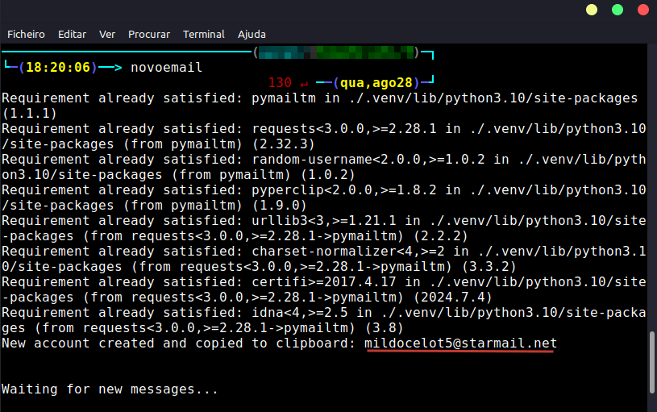

## Gere e-mails temporários através de um alias com pymailtm e zsh

## 🕶 Visão geral

Este script para [zsh](https://is.gd/9tbVJ8) automatiza a criação de e-mails temporários utilizando a ferramenta [pymailtm](https://is.gd/TFc6fU). Ele também inclui uma funcionalidade de limpeza que remove arquivos temporários e o ambiente virtual após a execução, garantindo que seu sistema permaneça limpo e mensagens recebidas sejam deletadas ao finalizar o script.

## 🛠️ Funcionalidade

1. **Criação e ativação do ambiente virtual:**
   
   - Cria e ativa um ambiente virtual Python (`.venv`) para isolar a instalação das dependências.

2. **Instalação do `pymailtm`:**
   
   - Instala a ferramenta `pymailtm` no ambiente virtual. A ferramenta está disponível em [pymailtm no PyPI](https://pypi.org/project/pymailtm/).

3. **Geração do e-mail temporário:**
   
   - Executa o comando `pymailtm -n` para criar um novo e-mail temporário.

4. **Limpeza automática:**
   
   - Remove arquivos temporários e desativa o ambiente virtual após a execução ou em caso de interrupção.

## 🧹 Funcionamento da limpeza

- **Durante a execução**:
  - O script executa o comando para gerar o e-mail temporário.
- **Após a execução**:
  - **Limpeza**: A função `clean_up` é chamada automaticamente para remover arquivos temporários no diretório `/tmp` e desativar o ambiente virtual.

## 🔧 Usando como um executável

1. **Clone o repositório:**

```
git clone https://github.com/aglairvta/pymailtm-zsh.git
```

2. **Torne o script executável:**

```
sudo chmod +x novoemail.sh
```

## 🧩 Usando como aliás através do zsh

Para facilitar a execução do seu script para gerar e-mails temporários, você pode configurá-lo como um alias no `zsh`. Isso permite que você execute o script com um simples comando no terminal, tornando o processo mais ágil e acessível.

1. **Clone o repositório:**

```
git clone https://github.com/aglairvta/pymailtm-zsh.git
```

2. **Torne o script executável:**

```
sudo chmod +x novoemail.sh
```

3. **Adicionar o alias no `.zshrc`:**

```
nano ~/.zshrc
```

4. **Adicione a seguinte linha ao final do arquivo para criar um alias. No exemplo abaixo, o alias é chamado de `novoemail`, mas você pode escolher qualquer nome que desejar.**

```
alias novoemail='/caminho/para/o/script/novoemail.sh'
```

5. **Recarregar o `.zshrc`:**

```
source ~/.zshrc
```

6. **Executar o alias**:

Agora, você pode usar o novo alias `novoemail` para executar o script diretamente no terminal. Basta digitar o comando:

```
novoemail
```

7. **Finalize e descarte o e-mail:**

```
ctrl + c
```

**Exemplo de saída:**



## ⭐ Créditos

- [mailtm - repositório](https://is.gd/TFc6fU)

- [mailtm - documentação](https://is.gd/GOym9G)

- [mailtm - aplicação online](https://is.gd/HOG3SF)

- [zsh - repositório](https://is.gd/9tbVJ8)
